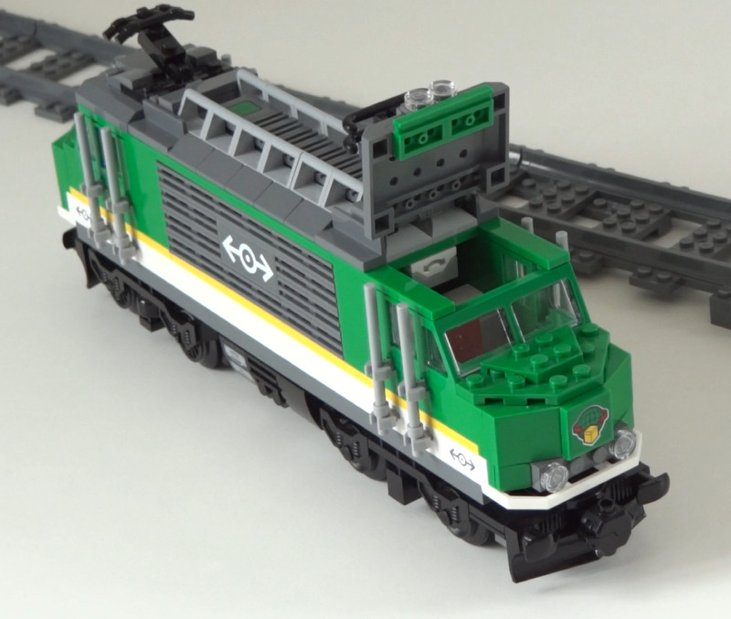

## Design modifications
Build the train using the standard instructions. Mount the
[tilt sensor][tiltsensor]
horizontally in the train, with the cable side facing towards direction of
driving:



Connect the motor to port A and connect the tilt sensor to port B.

## Program

This program makes the train drive until it detects a slope of 8 degrees or
more. Then it drives back down.


```python

```

## Programming and running instructions
The train must start on a horizontal track. Then run the program.

[tiltsensor]: https://docs.pybricks.com/en/latest/pupdevices/tiltsensor.html

