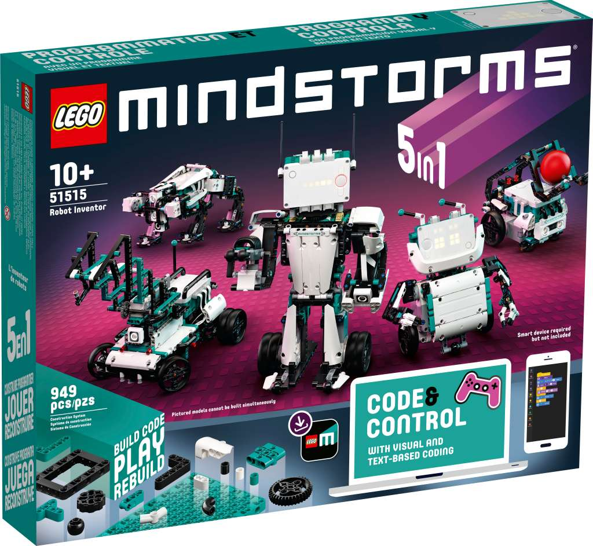
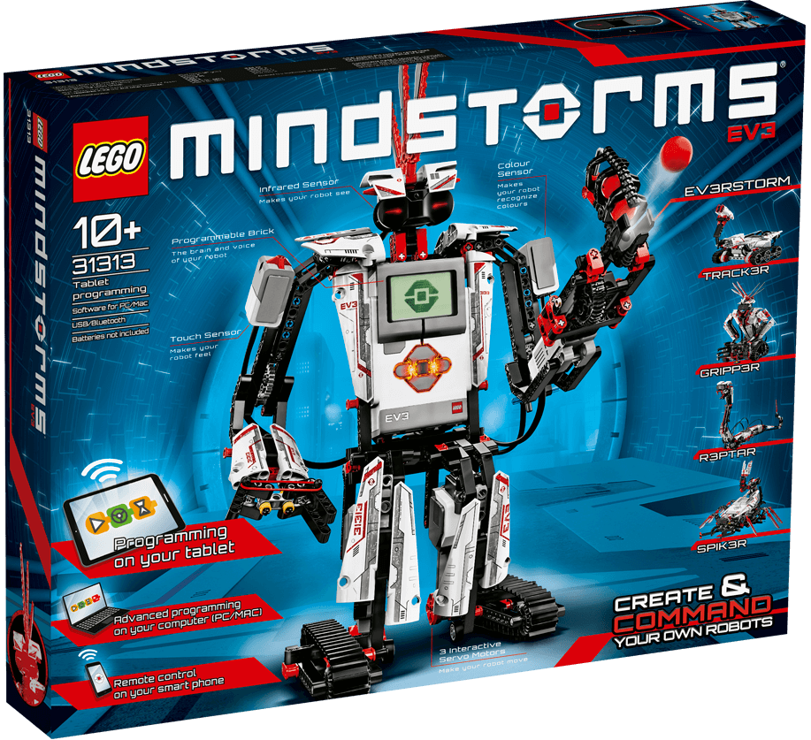
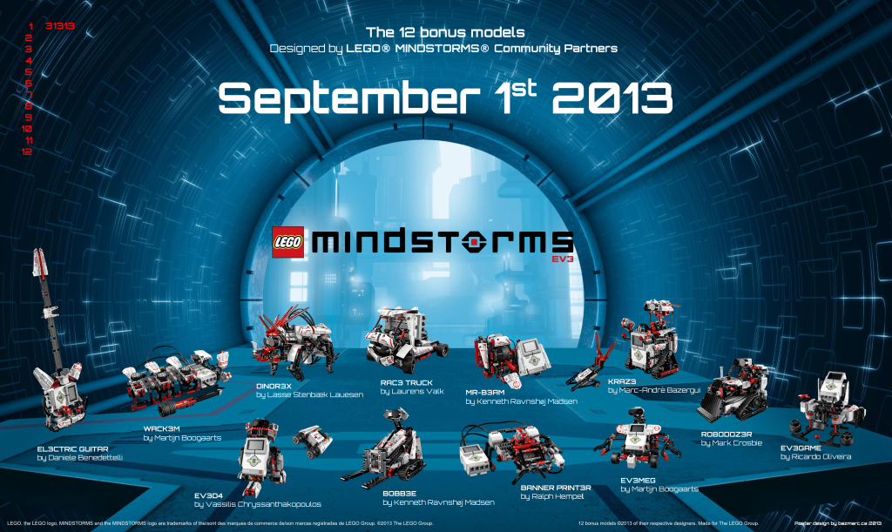
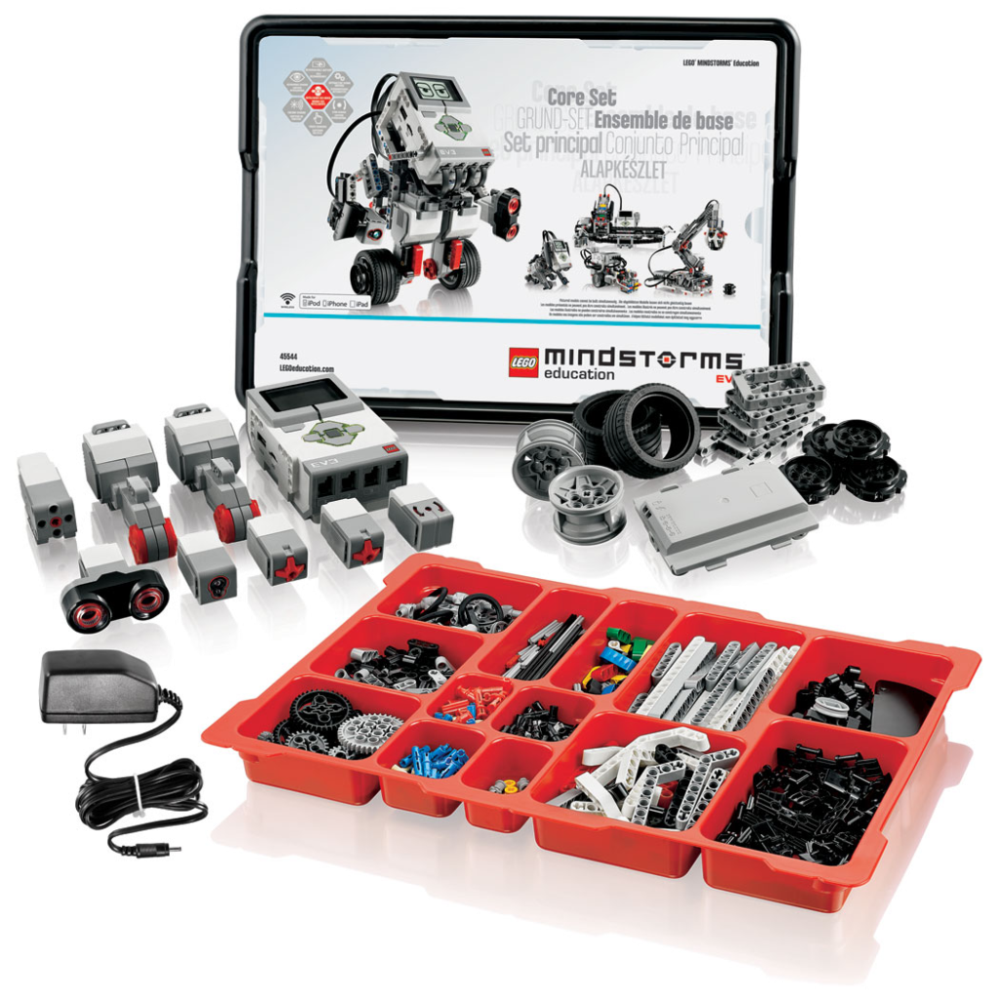
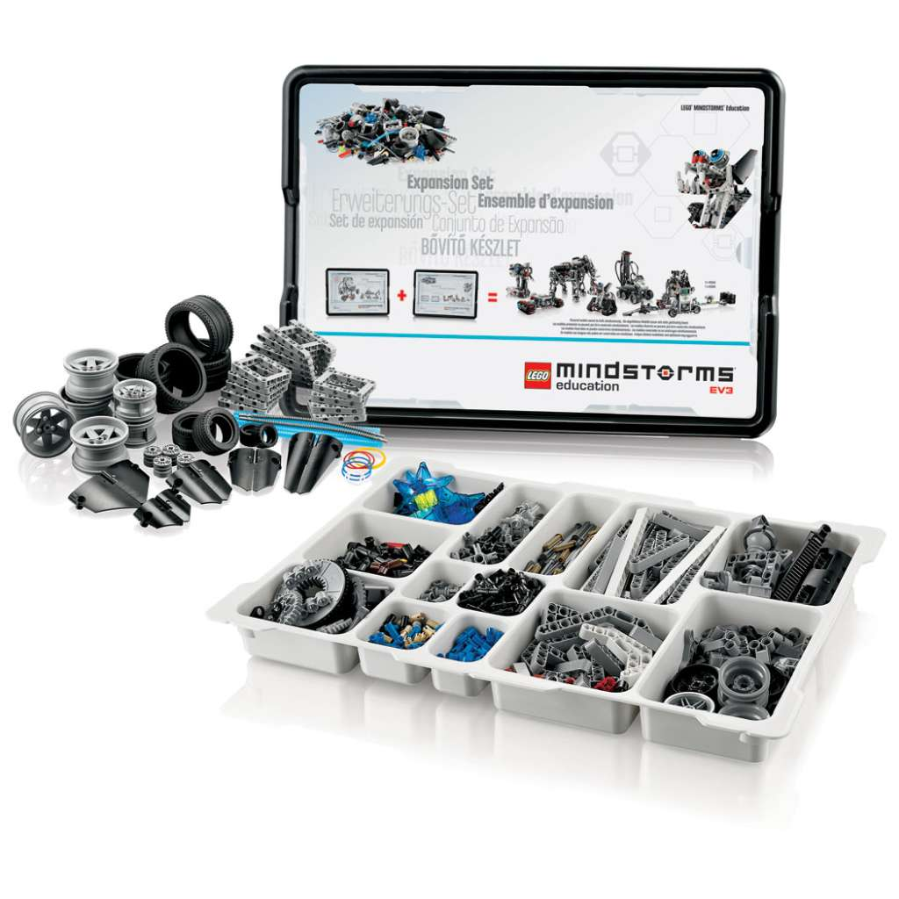

# Lego Mindstorms #
History of the Lego Mindstorms production line began in 1998 with release of Robotics Invention System 1.0. In 2006 was released Lego Mindstorms NXT, the second generation of Lego Mindstorms kit. NXT was surpassed in 2013 with Lego Mindstorms EV3. In 2020 was released fourth generation of Lego Mindstorms - Robot Inventor, which shares the central Hub, connectors, motors and sensors with Lego Education Spike Prime released in 2019.

Pybricks can run on Lego Mindstorms EV3 and Spike Prime/Robot Inventor. This folder contains example Python programs for official Lego Mindstorms set.

||||
|--|--|--|
||||
