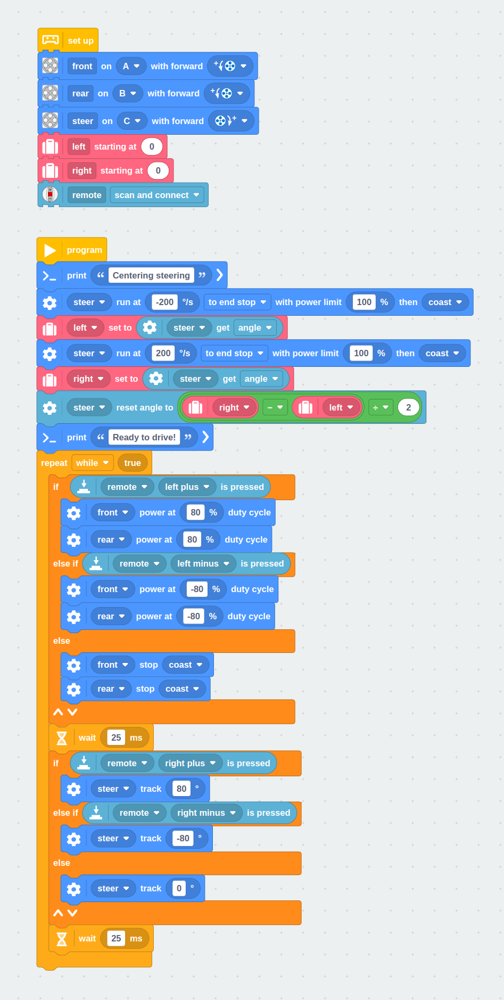

# Block Program

You can easily code this with the new block coding feature. Just drag and drop
the blocks as shown below.



# Python program

This program expands the [basic driving program](../driving) with the Powered
Up Remote.


```python

```
