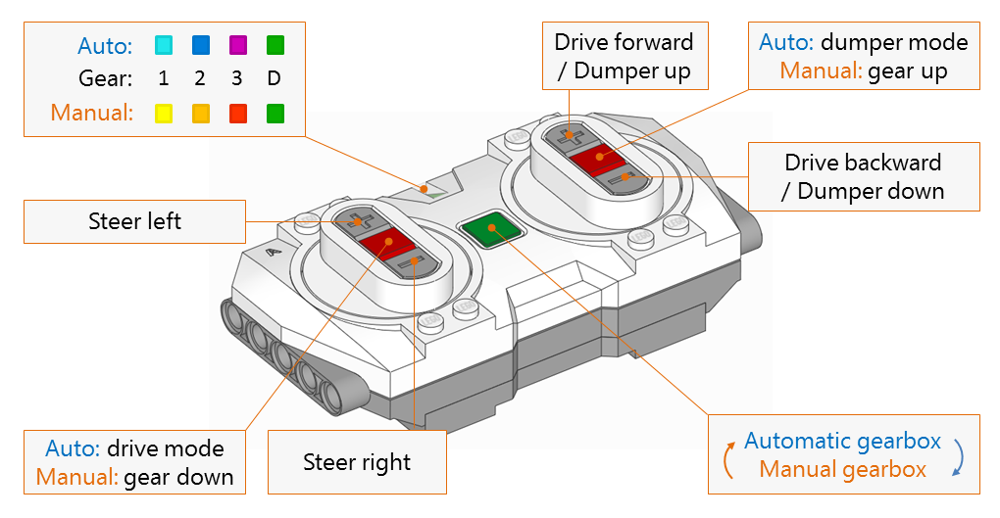

# Program 

The program for controlling Technic Volvo Articulated Hauler with remote control is more complicated than the other remote control programs because of the 3-gear gearbox, which works both in manual and automatic mode. Manual switching gears requires not only detection whether remote button is pressed or not, but rather detection of button pressing (or releasing) moment itself. This is realized using class '''Key'''. Automatic gearbox needs to detect proper time for switching gear up or down. This is possible by measuring speed of XL motor, when it is running. If the speed is systematically very low, the gear is decreased. If the speed is systematically close to maximum, the gear is increased. To make speed measurement robust to random variations, values obtained from speed sensor are filtered using simple [exponential smoothing|https://en.wikipedia.org/wiki/Exponential_smoothing]. Threshold values of speed, measurement time and smoothing constant are defined by constants `HI_SPEED, LO_SPEED`, `STABLE_SPEED_TIME` and `SMOOTHING`. If the automatic gearbox does not change gears even if Hauler reaches full speed, `HI_SPEED` should be decreased. Speed tracking, keeping the current state of gearbox and handling the remote/hub LEDs was implemented in the class '''Gearbox'''.

# Driving and switching gears

By default left controller controlls left/right steering, and right controller determines direction of driving. This can be changed easily by setting constant `LEFT_STEER_RIGHT_DRIVE` to False.

Gearbox can be used in two modes, as in the original LEGO smartphone app: *automatic* and *manual*. You can switch between the modes by pushing the green button on the remote. *Automatic* is default starting mode, but this can be easily changed by modifying constant `INIT_GEARBOX_AUTO`.

In the *automatic* mode, gears are changed when program detects that motor's speed is too slow or close to maximum speed. Current gear is indicated by the color of the remote's LED - 1: cyan, 2: blue, 3: magenta. To enable dumper (remote's LED: green), press right red button on the remote. To go back to driving mode, press left red button. If drive is idle for time longer than defined in constant `GEAR_RESET_TIMEOUT`, the gear is set to 1.

In the *manual* mode gear is decreased by pressing left red button, and increased with right red button. Gearbox positions are indicated by the color of LED: 1: yellow, 2: orange, 3: red, Dumper: green.

Sometimes gearbox tends to jam. If the target angle of gear selector is not reached within the time defined by `GEAR_SWITCH_TIMEOUT` (1.5sec by default), the automatic gearbox reset is performed. Hub's LED changes to red, while gearbox is recalibrated, setting gear to 1. 




```python

```
