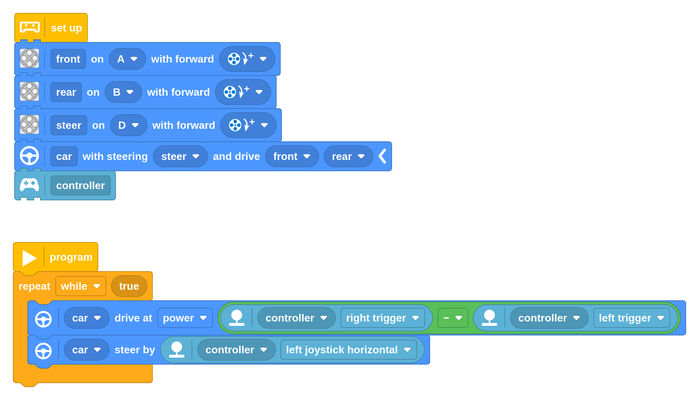

In this project we'll show you how to control the Audi RS Q e-tron with the
Xbox Controller, using either block programming or Python.

Be sure to check out the documentation in the Pybricks app for instructions
to pair the controller with the hub.

Note: This is brand a new feature. Try it with [Pybricks beta](https://beta.pybricks.com/)!

# Block Program

You can easily code this with the new block coding feature. Just drag and drop
the blocks as shown below, or download the ready-made project here. In
Pybricks, just go to the file menu and click the "Import a file" icon to open
it.

<a href="./audi_blocks.py" target="_blank" class="btn btn--primary"><i class="fas fa-puzzle-piece"></i>&nbsp;&nbsp;Download block program</a>



# Python Program


```python

```
