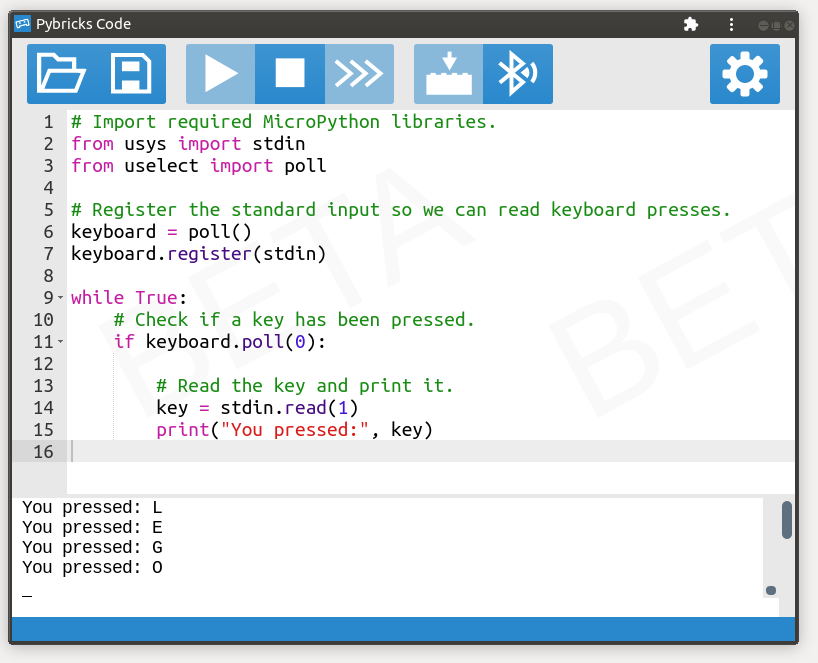

# How it works

Your MicroPython programs can produce *output* using the `print` command, but
it can also read *input*. To enter input, just click on the terminal window
and press some keys.



You can read keyboard presses using `stdin`, as shown in the example below.
Then you can make your program choose different behaviors based on which key
is pressed.


```python

```
